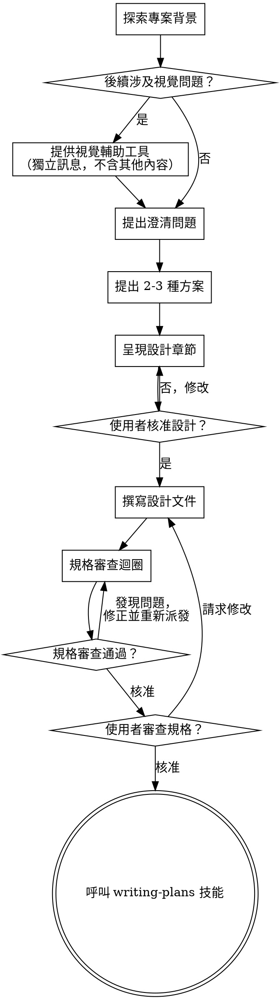

# 將構想發展為設計

透過自然的協作對話，協助將構想轉化為完整的設計與規格。

先了解當前的專案背景，然後逐一提問以精煉構想。一旦了解要建立的內容，呈現設計並取得使用者核准。

<HARD-GATE>
在您呈現設計並獲得使用者核准之前，請勿呼叫任何實作技能、撰寫任何程式碼、搭建任何專案，或採取任何實作行動。無論專案看起來多簡單，此規則適用於所有專案。
</HARD-GATE>

## 反模式：「這太簡單了，不需要設計」

每個專案都需要經歷這個流程。待辦清單、單一函式的工具程式、設定變更——全都一樣。「簡單」的專案反而是未經檢視的假設造成最多浪費工作的地方。設計可以很短（對於真正簡單的專案只需幾句話），但您必須呈現設計並取得核准。

## 檢查清單

您必須為以下每個項目建立任務，並按順序完成：

1. **探索專案背景** — 檢查檔案、文件、近期提交記錄
2. **提供視覺輔助工具**（如果主題涉及視覺問題）— 這是獨立的訊息，不與澄清問題合併。請參閱下方的視覺輔助工具章節。
3. **提出澄清問題** — 每次一個，了解目的／限制／成功標準
4. **提出 2-3 種方案** — 包含取捨分析與您的建議
5. **呈現設計** — 按複雜度分段呈現，每段後取得使用者核准
6. **撰寫設計文件** — 儲存至 `docs/superpowers/specs/YYYY-MM-DD-<topic>-design.md` 並提交
7. **規格審查迴圈** — 派發 spec-document-reviewer 子代理人，提供精確撰寫的審查背景（絕非您的對話歷史）；修正問題並重新派發直到核准（最多 3 次迭代，超過則提交給人工處理）
8. **使用者審查已撰寫的規格** — 在繼續之前，請使用者審查規格檔案
9. **轉入實作** — 呼叫 writing-plans 技能以建立實作計畫

## 流程圖

**最終狀態是呼叫 writing-plans。** 請勿呼叫 frontend-design、mcp-builder 或任何其他實作技能。腦力激盪後，您唯一呼叫的技能是 writing-plans。

## 流程說明

**了解構想：**

- 首先查看當前的專案狀態（檔案、文件、近期提交記錄）
- 在提出詳細問題之前，先評估範疇：如果請求描述了多個獨立子系統（例如「建立一個包含聊天、檔案儲存、計費和分析的平台」），請立即標記此情況。不要花費問題來精煉一個需要先分解的專案。
- 如果專案太大，無法用單一規格涵蓋，請協助使用者分解為子專案：哪些是獨立的部分、它們之間如何關聯、應按什麼順序建立？然後透過正常設計流程對第一個子專案進行腦力激盪。每個子專案都有其自己的規格 → 計畫 → 實作週期。
- 對於範疇適當的專案，逐一提問以精煉構想
- 盡可能偏好選擇題，但開放式問題也可以
- 每則訊息只有一個問題——如果某個主題需要更多探索，請拆分為多個問題
- 專注於了解：目的、限制、成功標準

**探索方案：**

- 提出 2-3 種不同方案，並說明各自的取捨
- 以對話方式呈現選項，包含您的建議與理由
- 以您推薦的選項為先，並說明原因

**呈現設計：**

- 一旦您認為了解要建立的內容，就呈現設計
- 根據各章節的複雜度調整篇幅：直接了當的內容用幾句話，細緻複雜的內容最多 200-300 字
- 每個章節後詢問目前看起來是否正確
- 涵蓋：架構、元件、資料流、錯誤處理、測試
- 準備好在某些地方不合理時，回頭進行澄清

**為隔離性與清晰度而設計：**

- 將系統拆分為更小的單元，每個單元有一個明確的目的，透過定義良好的介面進行通訊，且可以獨立理解和測試
- 對於每個單元，您應該能夠回答：它做什麼、如何使用它，以及它依賴什麼？
- 是否有人能在不閱讀其內部實作的情況下理解某個單元的功能？您能在不影響使用者的情況下更改內部實作嗎？如果不能，邊界需要調整。
- 更小、邊界清晰的單元也更易於您處理——您對能一次掌握上下文的程式碼推理更好，當檔案聚焦時，您的編輯也更可靠。當檔案變得龐大時，那通常是它承擔太多職責的訊號。

**在現有程式碼庫中工作：**

- 在提出變更建議之前，先探索當前結構。遵循現有模式。
- 如果現有程式碼存在影響工作的問題（例如，某個檔案已過於龐大、邊界不清晰、職責混亂），請將有針對性的改善納入設計中——就像一位優秀的開發者改善他們正在工作的程式碼一樣。
- 不要提出與當前目標無關的重構。保持專注於服務當前目標的事情。

## 設計完成後

**文件：**

- 將已驗證的設計（規格）撰寫至 `docs/superpowers/specs/YYYY-MM-DD-<topic>-design.md`
  - （使用者對規格位置的偏好優先於此預設值）
- 如果有 elements-of-style:writing-clearly-and-concisely 技能，請使用
- 將設計文件提交至 git

**規格審查迴圈：**
撰寫規格文件後：

1. 派發 spec-document-reviewer 子代理人（請參閱 spec-document-reviewer-prompt.md）
2. 如果發現問題：修正、重新派發，重複直到核准
3. 如果迴圈超過 3 次迭代，提交給人工尋求指導

**使用者審查關卡：**
規格審查迴圈通過後，在繼續之前，請使用者審查已撰寫的規格：

> 「規格已撰寫並提交至 `<path>`。請審查它，如果您想在我們開始撰寫實作計畫之前進行任何修改，請告訴我。」

等待使用者的回應。如果他們請求修改，請進行修改並重新執行規格審查迴圈。只有在使用者核准後才能繼續。

**實作：**

- 呼叫 writing-plans 技能以建立詳細的實作計畫
- 請勿呼叫任何其他技能。writing-plans 是下一步。

## 關鍵原則

- **每次一個問題** — 不要用多個問題淹沒使用者
- **偏好選擇題** — 在可能的情況下，比開放式問題更容易回答
- **嚴格執行 YAGNI** — 從所有設計中移除不必要的功能
- **探索替代方案** — 在確定前始終提出 2-3 種方案
- **漸進式驗證** — 呈現設計，在繼續之前取得核准
- **保持彈性** — 在某些地方不合理時，回頭澄清

## 視覺輔助工具

一個基於瀏覽器的輔助工具，用於在腦力激盪過程中展示模型圖、圖表和視覺選項。作為工具提供——而非模式。接受輔助工具表示它可用於受益於視覺處理的問題；這並不意味著每個問題都要透過瀏覽器處理。

**提供輔助工具：** 當您預期即將提出的問題將涉及視覺內容（模型圖、版面、圖表）時，請一次性提出以取得同意：
> 「我們正在處理的某些內容，如果我能在網頁瀏覽器中展示給您，可能會更容易說明。在我們討論的過程中，我可以製作模型圖、圖表、比較圖和其他視覺效果。此功能仍然較新，可能需要較多 token。您想試試嗎？（需要開啟本機 URL）」

**此提議必須是獨立的訊息。** 不要將它與澄清問題、背景摘要或任何其他內容合併。訊息應只包含上述提議，不含其他內容。等待使用者的回應後再繼續。如果他們拒絕，則以純文字模式進行腦力激盪。

**逐問決策：** 即使在使用者接受後，對每個問題單獨決定是否使用瀏覽器或終端機。測試：**使用者透過看到它比閱讀它能更好地理解嗎？**

- **使用瀏覽器** 處理本質上是視覺的內容 — 模型圖、線框圖、版面比較、架構圖、並排視覺設計
- **使用終端機** 處理文字內容 — 需求問題、概念選擇、取捨清單、A/B/C/D 文字選項、範疇決策

關於 UI 主題的問題並不自動是視覺問題。「在此背景下，個性是什麼意思？」是概念性問題——使用終端機。「哪種精靈版面配置更好？」是視覺問題——使用瀏覽器。

如果他們同意使用輔助工具，請在繼續前閱讀詳細指南：
`skills/brainstorming/visual-companion.md`
