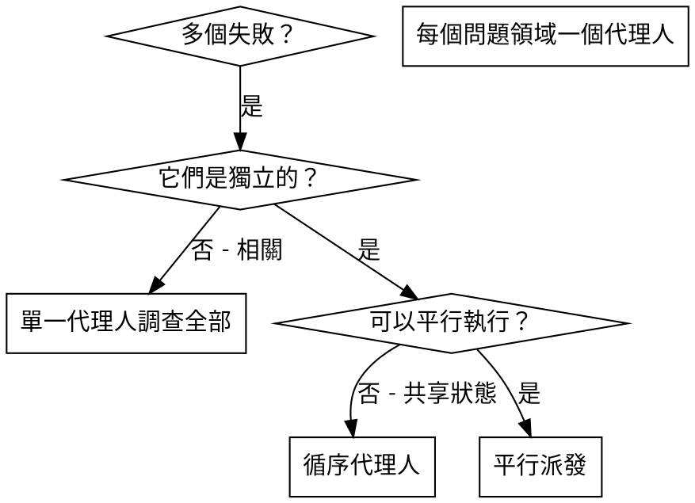

# 派發平行代理人

## 概述

您將任務委派給具有隔離背景的專業代理人。透過精確地製作其指令和背景，您確保他們保持專注並成功完成任務。他們絕不應繼承您的工作階段背景或歷史——您建構他們所需的確切內容。這也為您自己保留了協調工作的背景。

當您有多個不相關的失敗（不同的測試檔案、不同的子系統、不同的錯誤）時，循序調查它們會浪費時間。每次調查都是獨立的，可以平行進行。

**核心原則：** 每個獨立的問題領域派發一個代理人。讓他們並行工作。

## 使用時機



**適用情境：**
- 3 個以上測試檔案因不同根本原因而失敗
- 多個子系統獨立損壞
- 每個問題可以在不需要其他問題背景的情況下理解
- 調查之間沒有共享狀態

**不適用情境：**
- 失敗相互關聯（修復其一可能修復其他）
- 需要了解完整的系統狀態
- 代理人會相互干擾

## 模式

### 1. 識別獨立領域

按損壞的內容對失敗進行分組：
- 檔案 A 的測試：工具核准流程
- 檔案 B 的測試：批次完成行為
- 檔案 C 的測試：中止功能

每個領域是獨立的——修復工具核准不影響中止測試。

### 2. 建立專注的代理人任務

每個代理人取得：
- **具體範疇：** 一個測試檔案或子系統
- **明確目標：** 使這些測試通過
- **限制條件：** 不要更改其他程式碼
- **預期輸出：** 您發現和修復的內容摘要

### 3. 平行派發

```typescript
// In Claude Code / AI environment
Task("Fix agent-tool-abort.test.ts failures")
Task("Fix batch-completion-behavior.test.ts failures")
Task("Fix tool-approval-race-conditions.test.ts failures")
// All three run concurrently
```

### 4. 審查與整合

代理人回傳後：
- 閱讀每個摘要
- 驗證修復不衝突
- 執行完整測試套件
- 整合所有變更

## 代理人提示結構

好的代理人提示具備：
1. **專注** — 一個明確的問題領域
2. **自給自足** — 了解問題所需的所有背景
3. **具體說明輸出** — 代理人應回傳什麼？

```markdown
Fix the 3 failing tests in src/agents/agent-tool-abort.test.ts:

1. "should abort tool with partial output capture" - expects 'interrupted at' in message
2. "should handle mixed completed and aborted tools" - fast tool aborted instead of completed
3. "should properly track pendingToolCount" - expects 3 results but gets 0

These are timing/race condition issues. Your task:

1. Read the test file and understand what each test verifies
2. Identify root cause - timing issues or actual bugs?
3. Fix by:
   - Replacing arbitrary timeouts with event-based waiting
   - Fixing bugs in abort implementation if found
   - Adjusting test expectations if testing changed behavior

Do NOT just increase timeouts - find the real issue.

Return: Summary of what you found and what you fixed.
```

## 常見錯誤

**❌ 太廣泛：** 「修復所有測試」— 代理人迷失方向
**✅ 具體：** 「修復 agent-tool-abort.test.ts」— 聚焦範疇

**❌ 無背景：** 「修復競態條件」— 代理人不知道在哪裡
**✅ 有背景：** 貼上錯誤訊息和測試名稱

**❌ 無限制：** 代理人可能重構所有內容
**✅ 有限制：** 「不要更改正式環境程式碼」或「只修復測試」

**❌ 模糊輸出：** 「修復它」— 您不知道什麼改變了
**✅ 具體：** 「回傳根本原因和變更的摘要」

## 不適用情境

**相關失敗：** 修復其一可能修復其他——先一起調查
**需要完整背景：** 理解需要查看整個系統
**探索性除錯：** 您還不知道什麼損壞了
**共享狀態：** 代理人會相互干擾（編輯相同的檔案、使用相同的資源）

## 來自工作階段的真實範例

**情境：** 主要重構後，3 個檔案中有 6 個測試失敗

**失敗：**
- agent-tool-abort.test.ts：3 個失敗（時序問題）
- batch-completion-behavior.test.ts：2 個失敗（工具未執行）
- tool-approval-race-conditions.test.ts：1 個失敗（執行次數 = 0）

**決策：** 獨立領域——中止邏輯與批次完成和競態條件各自分離

**派發：**
```
代理人 1 → 修復 agent-tool-abort.test.ts
代理人 2 → 修復 batch-completion-behavior.test.ts
代理人 3 → 修復 tool-approval-race-conditions.test.ts
```

**結果：**
- 代理人 1：以事件驅動的等待取代逾時
- 代理人 2：修復事件結構錯誤（threadId 放在錯誤位置）
- 代理人 3：添加等待非同步工具執行完成

**整合：** 所有修復獨立，無衝突，完整套件全部通過

**節省時間：** 3 個問題平行解決，而非循序處理

## 主要優點

1. **平行化** — 多個調查同時進行
2. **專注** — 每個代理人範疇窄，需要追蹤的背景較少
3. **獨立性** — 代理人不相互干擾
4. **速度** — 用 1 個問題的時間解決 3 個問題

## 驗證

代理人回傳後：
1. **審查每個摘要** — 了解什麼改變了
2. **檢查衝突** — 代理人是否編輯了相同的程式碼？
3. **執行完整套件** — 驗證所有修復一起工作
4. **抽樣檢查** — 代理人可能會犯系統性錯誤

## 真實世界的影響

來自除錯工作階段（2025-10-03）：
- 3 個檔案中有 6 個失敗
- 3 個代理人平行派發
- 所有調查並行完成
- 所有修復成功整合
- 代理人變更之間零衝突
