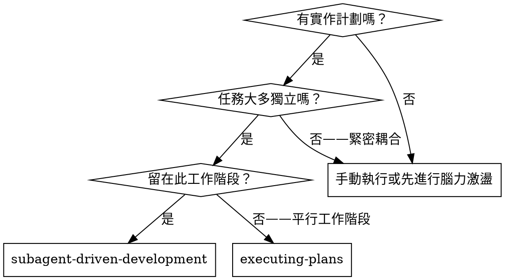
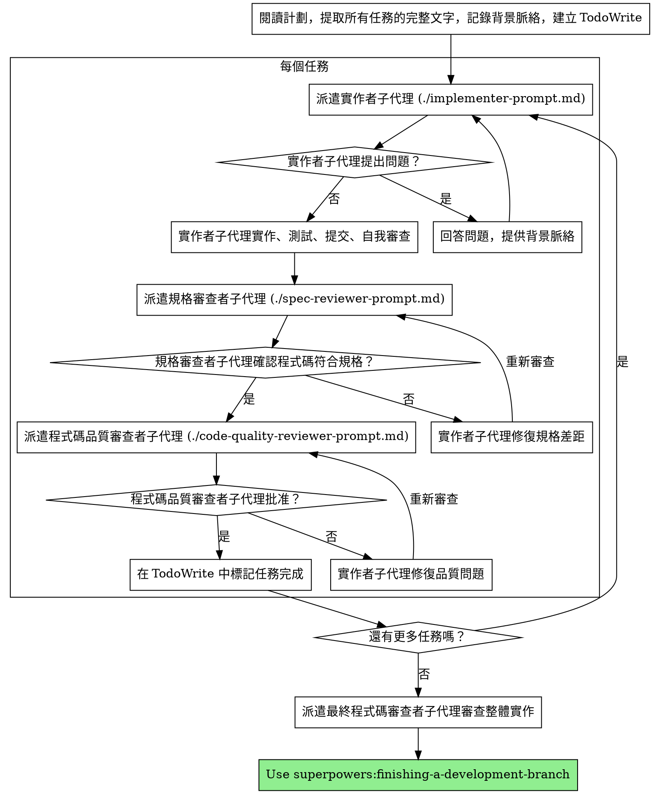

# 子代理驅動開發

透過為每個任務派遣全新子代理來執行計劃，並在每個任務後進行兩階段審查：先進行規格合規審查，再進行程式碼品質審查。

**為什麼使用子代理：** 您將任務委派給具有隔離背景脈絡的專業代理。透過精確地設計其指令和背景脈絡，確保它們保持專注並成功完成任務。它們絕不應繼承您的工作階段背景或歷史記錄——您精確地建構它們所需的內容。這也保留了您自己用於協調工作的背景脈絡。

**核心原則：** 每個任務使用全新子代理 + 兩階段審查（規格合規，再到品質）= 高品質、快速迭代

## 何時使用



**與執行計劃（平行工作階段）的比較：**
- 相同工作階段（無背景脈絡切換）
- 每個任務使用全新子代理（無背景脈絡污染）
- 每個任務後進行兩階段審查：先規格合規，再程式碼品質
- 更快的迭代（任務之間無需人工介入）

## 流程



## 模型選擇

使用能夠處理每個角色的最低效能模型，以節省成本並提高速度。

**機械性實作任務**（隔離函數、明確規格、1-2 個檔案）：使用快速且廉價的模型。當計劃規格明確時，大多數實作任務都是機械性的。

**整合與判斷任務**（多檔案協調、模式匹配、除錯）：使用標準模型。

**架構、設計和審查任務**：使用最強大的可用模型。

**任務複雜度信號：**
- 涉及 1-2 個檔案且有完整規格 → 廉價模型
- 涉及多個檔案且有整合考量 → 標準模型
- 需要設計判斷或廣泛程式碼庫理解 → 最強大模型

## 處理實作者狀態

實作者子代理回報四種狀態之一。請適當處理各種狀態：

**DONE：** 繼續進行規格合規審查。

**DONE_WITH_CONCERNS：** 實作者完成了工作但標記了疑慮。在繼續之前閱讀這些疑慮。如果疑慮關於正確性或範圍，在審查之前先處理它們。如果是觀察性意見（例如「這個檔案越來越大」），記錄下來並繼續進行審查。

**NEEDS_CONTEXT：** 實作者需要未提供的資訊。提供缺失的背景脈絡並重新派遣。

**BLOCKED：** 實作者無法完成任務。評估阻塞原因：
1. 如果是背景脈絡問題，提供更多背景脈絡並以相同模型重新派遣
2. 如果任務需要更多推理，以更強大的模型重新派遣
3. 如果任務太大，將其拆分為更小的部分
4. 如果計劃本身有誤，向人類升級

**絕不**忽略升級請求，或在未做出改變的情況下強迫相同的模型重試。如果實作者表示卡住了，就需要做出改變。

## 提示範本

- `./implementer-prompt.md` - 派遣實作者子代理
- `./spec-reviewer-prompt.md` - 派遣規格合規審查者子代理
- `./code-quality-reviewer-prompt.md` - 派遣程式碼品質審查者子代理

## 範例工作流程

```
您：我正在使用子代理驅動開發來執行此計劃。

[一次性讀取計劃檔案：docs/superpowers/plans/feature-plan.md]
[提取所有 5 個任務的完整文字和背景脈絡]
[建立包含所有任務的 TodoWrite]

任務 1：Hook 安裝腳本

[取得任務 1 的文字和背景脈絡（已提取）]
[派遣實作子代理，附完整任務文字和背景脈絡]

實作者：「開始之前——hook 應安裝在使用者層級還是系統層級？」

您：「使用者層級（~/.config/superpowers/hooks/）」

實作者：「明白了。現在開始實作……」
[稍後] 實作者：
  - 已實作 install-hook 指令
  - 新增測試，5/5 通過
  - 自我審查：發現遺漏了 --force 旗標，已新增
  - 已提交

[派遣規格合規審查者]
規格審查者：✅ 規格合規——所有需求均已滿足，沒有多餘內容

[取得 git SHA，派遣程式碼品質審查者]
程式碼審查者：優點：良好的測試覆蓋率，乾淨。問題：無。批准。

[標記任務 1 完成]

任務 2：恢復模式

[取得任務 2 的文字和背景脈絡（已提取）]
[派遣實作子代理，附完整任務文字和背景脈絡]

實作者：[無問題，直接進行]
實作者：
  - 新增了驗證/修復模式
  - 8/8 測試通過
  - 自我審查：一切正常
  - 已提交

[派遣規格合規審查者]
規格審查者：❌ 問題：
  - 缺少：進度報告（規格說「每 100 個項目報告一次」）
  - 多餘：新增了 --json 旗標（未要求）

[實作者修復問題]
實作者：已移除 --json 旗標，新增了進度報告

[規格審查者再次審查]
規格審查者：✅ 現在規格合規

[派遣程式碼品質審查者]
程式碼審查者：優點：穩固。問題（重要）：魔術數字 (100)

[實作者修復]
實作者：已提取 PROGRESS_INTERVAL 常數

[程式碼審查者再次審查]
程式碼審查者：✅ 批准

[標記任務 2 完成]

...

[所有任務完成後]
[派遣最終程式碼審查者]
最終審查者：所有需求均已滿足，可以合併

完成！
```

## 優勢

**與手動執行相比：**
- 子代理自然地遵循 TDD
- 每個任務使用全新背景脈絡（不混淆）
- 平行安全（子代理不互相干擾）
- 子代理可以提問（在工作開始之前和期間）

**與執行計劃相比：**
- 相同工作階段（無交接）
- 持續進展（無等待）
- 自動設置審查檢查點

**效率提升：**
- 無檔案讀取開銷（控制器提供完整文字）
- 控制器精確策劃所需的背景脈絡
- 子代理預先獲得完整資訊
- 問題在工作開始前浮現（而非之後）

**品質關卡：**
- 自我審查在交接前捕捉問題
- 兩階段審查：規格合規，再到程式碼品質
- 審查迴圈確保修復實際有效
- 規格合規防止過度/不足建置
- 程式碼品質確保實作建置良好

**成本：**
- 更多子代理調用（每個任務：實作者 + 2 個審查者）
- 控制器做更多準備工作（預先提取所有任務）
- 審查迴圈增加迭代次數
- 但能及早捕捉問題（比後期除錯更便宜）

## 紅旗警示

**絕對不要：**
- 未經使用者明確同意就在 main/master 分支上開始實作
- 跳過審查（規格合規或程式碼品質）
- 在未修復問題的情況下繼續進行
- 平行派遣多個實作子代理（會產生衝突）
- 讓子代理讀取計劃檔案（改為提供完整文字）
- 跳過場景設定背景脈絡（子代理需要了解任務所在的位置）
- 忽略子代理的問題（在讓其繼續之前先回答）
- 接受規格合規上的「差不多」（規格審查者發現問題 = 未完成）
- 跳過審查迴圈（審查者發現問題 = 實作者修復 = 再次審查）
- 讓實作者的自我審查取代實際審查（兩者都需要）
- **在規格合規 ✅ 之前開始程式碼品質審查**（順序錯誤）
- 在任一審查仍有未解決問題時移至下一個任務

**若子代理提出問題：**
- 清楚完整地回答
- 如有需要提供額外背景脈絡
- 不要催促其進入實作

**若審查者發現問題：**
- 實作者（相同的子代理）修復它們
- 審查者再次審查
- 重複直到批准
- 不要跳過重新審查

**若子代理無法完成任務：**
- 派遣具有具體指令的修復子代理
- 不要嘗試手動修復（會污染背景脈絡）

## 整合

**必要工作流程技能：**
- **superpowers:using-git-worktrees** - 必要：在開始之前設置隔離工作區
- **superpowers:writing-plans** - 建立此技能所執行的計劃
- **superpowers:requesting-code-review** - 審查者子代理的程式碼審查範本
- **superpowers:finishing-a-development-branch** - 所有任務後完成開發

**子代理應使用：**
- **superpowers:test-driven-development** - 子代理為每個任務遵循 TDD

**替代工作流程：**
- **superpowers:executing-plans** - 用於平行工作階段而非相同工作階段執行
