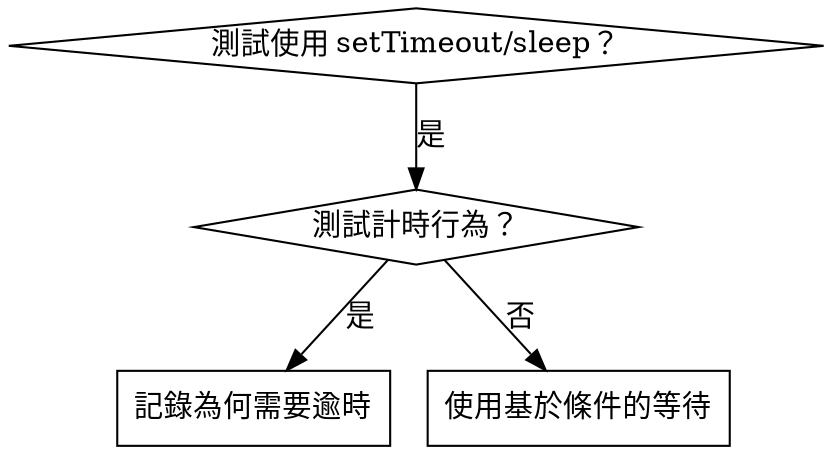

# 基於條件的等待

## 概述

脆弱的測試通常用任意延遲來猜測時間。這會產生競爭條件，使測試在快速機器上通過，但在高負載或 CI 環境中失敗。

**核心原則：** 等待你真正關心的條件，而不是猜測需要多長時間。

## 何時使用



**適用時機：**
- 測試有任意延遲（`setTimeout`、`sleep`、`time.sleep()`）
- 測試結果不穩定（有時通過，有時在高負載下失敗）
- 並行執行時測試逾時
- 等待非同步操作完成

**不適用時機：**
- 測試實際計時行為（防抖、節流間隔）
- 若使用任意逾時，務必記錄原因

## 核心模式

```typescript
// ❌ BEFORE: Guessing at timing
await new Promise(r => setTimeout(r, 50));
const result = getResult();
expect(result).toBeDefined();

// ✅ AFTER: Waiting for condition
await waitFor(() => getResult() !== undefined);
const result = getResult();
expect(result).toBeDefined();
```

## 快速模式

| 場景 | 模式 |
|----------|---------|
| 等待事件 | `waitFor(() => events.find(e => e.type === 'DONE'))` |
| 等待狀態 | `waitFor(() => machine.state === 'ready')` |
| 等待計數 | `waitFor(() => items.length >= 5)` |
| 等待檔案 | `waitFor(() => fs.existsSync(path))` |
| 複雜條件 | `waitFor(() => obj.ready && obj.value > 10)` |

## 實作

通用輪詢函式：
```typescript
async function waitFor<T>(
  condition: () => T | undefined | null | false,
  description: string,
  timeoutMs = 5000
): Promise<T> {
  const startTime = Date.now();

  while (true) {
    const result = condition();
    if (result) return result;

    if (Date.now() - startTime > timeoutMs) {
      throw new Error(`Timeout waiting for ${description} after ${timeoutMs}ms`);
    }

    await new Promise(r => setTimeout(r, 10)); // Poll every 10ms
  }
}
```

請參閱此目錄中的 `condition-based-waiting-example.ts`，以取得包含領域特定輔助函式（`waitForEvent`、`waitForEventCount`、`waitForEventMatch`）的完整實作，這些函式來自實際除錯工作階段。

## 常見錯誤

**❌ 輪詢過快：** `setTimeout(check, 1)` - 浪費 CPU
**✅ 修正：** 每 10ms 輪詢一次

**❌ 無逾時：** 若條件永不滿足則無限迴圈
**✅ 修正：** 務必包含含有清楚錯誤訊息的逾時

**❌ 過時資料：** 在迴圈前快取狀態
**✅ 修正：** 在迴圈內呼叫 getter 以取得最新資料

## 任意逾時確實正確的時機

```typescript
// Tool ticks every 100ms - need 2 ticks to verify partial output
await waitForEvent(manager, 'TOOL_STARTED'); // First: wait for condition
await new Promise(r => setTimeout(r, 200));   // Then: wait for timed behavior
// 200ms = 2 ticks at 100ms intervals - documented and justified
```

**要求：**
1. 首先等待觸發條件
2. 基於已知時間（非猜測）
3. 附上說明原因的註解

## 實際影響

來自除錯工作階段（2025-10-03）：
- 修復了 3 個檔案中共 15 個不穩定測試
- 通過率：60% → 100%
- 執行時間：快了 40%
- 不再有競爭條件
