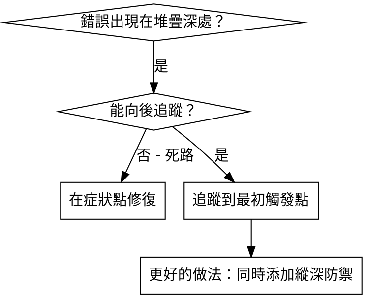
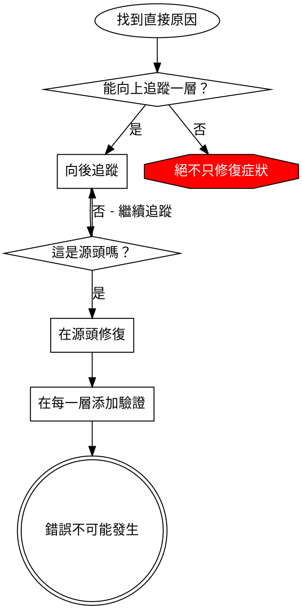

# 根本原因追蹤

## 概述

錯誤通常深深地顯現在呼叫堆疊中（在錯誤目錄執行 git init、在錯誤位置建立檔案、以錯誤路徑開啟資料庫）。你的直覺是在錯誤出現的地方修復它，但那只是在治療症狀。

**核心原則：** 沿著呼叫鏈向後追蹤，直到找到最初的觸發點，然後在源頭修復。

## 何時使用



**適用時機：**
- 錯誤發生在執行深處（不在入口點）
- 堆疊追蹤顯示長長的呼叫鏈
- 不清楚無效資料的來源
- 需要找出哪個測試/程式碼觸發了問題

## 追蹤過程

### 1. 觀察症狀
```
Error: git init failed in /Users/jesse/project/packages/core
```

### 2. 找出直接原因
**哪段程式碼直接造成這個問題？**
```typescript
await execFileAsync('git', ['init'], { cwd: projectDir });
```

### 3. 詢問：是什麼呼叫了這個？
```typescript
WorktreeManager.createSessionWorktree(projectDir, sessionId)
  → called by Session.initializeWorkspace()
  → called by Session.create()
  → called by test at Project.create()
```

### 4. 繼續向上追蹤
**傳遞了什麼值？**
- `projectDir = ''`（空字串！）
- 空字串作為 `cwd` 會解析為 `process.cwd()`
- 那就是原始碼目錄！

### 5. 找出最初觸發點
**空字串從何而來？**
```typescript
const context = setupCoreTest(); // Returns { tempDir: '' }
Project.create('name', context.tempDir); // Accessed before beforeEach!
```

## 添加堆疊追蹤

當你無法手動追蹤時，添加儀器：

```typescript
// Before the problematic operation
async function gitInit(directory: string) {
  const stack = new Error().stack;
  console.error('DEBUG git init:', {
    directory,
    cwd: process.cwd(),
    nodeEnv: process.env.NODE_ENV,
    stack,
  });

  await execFileAsync('git', ['init'], { cwd: directory });
}
```

**重要：** 在測試中使用 `console.error()`（而非 logger，因為 logger 可能不會顯示）

**執行並擷取：**
```bash
npm test 2>&1 | grep 'DEBUG git init'
```

**分析堆疊追蹤：**
- 尋找測試檔案名稱
- 找出觸發呼叫的行號
- 識別模式（同一個測試？同一個參數？）

## 找出哪個測試造成污染

如果在測試期間出現某些東西但不知道是哪個測試：

使用此目錄中的二分查找腳本 `find-polluter.sh`：

```bash
./find-polluter.sh '.git' 'src/**/*.test.ts'
```

逐一執行測試，在第一個污染者處停止。詳見腳本的使用說明。

## 真實範例：空的 projectDir

**症狀：** `.git` 建立在 `packages/core/`（原始碼）中

**追蹤鏈：**
1. `git init` 在 `process.cwd()` 中執行 ← 空的 cwd 參數
2. `WorktreeManager` 以空的 `projectDir` 被呼叫
3. `Session.create()` 傳遞了空字串
4. 測試在 `beforeEach` 之前存取了 `context.tempDir`
5. `setupCoreTest()` 初始返回 `{ tempDir: '' }`

**根本原因：** 頂層變數初始化存取了空值

**修復：** 將 `tempDir` 改為在 `beforeEach` 之前存取時會拋出錯誤的 getter

**同時添加了縱深防禦：**
- 第一層：`Project.create()` 驗證目錄
- 第二層：`WorkspaceManager` 驗證非空
- 第三層：`NODE_ENV` 守衛拒絕在 tmpdir 以外執行 `git init`
- 第四層：在 `git init` 之前記錄堆疊追蹤

## 關鍵原則



**絕不只在錯誤出現的地方修復。** 向後追蹤以找出最初的觸發點。

## 堆疊追蹤技巧

**在測試中：** 使用 `console.error()` 而非 logger，因為 logger 可能被抑制
**在操作之前：** 在危險操作之前記錄，而非在失敗後記錄
**包含上下文：** 目錄、cwd、環境變數、時間戳記
**擷取堆疊：** `new Error().stack` 顯示完整的呼叫鏈

## 實際影響

來自除錯工作階段（2025-10-03）：
- 透過 5 層追蹤找到根本原因
- 在源頭修復（getter 驗證）
- 添加了 4 層防禦
- 1847 個測試通過，零污染
