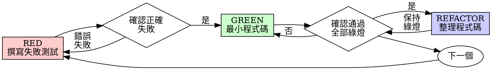

# 測試驅動開發（TDD）

## 概述

先寫測試。看著它失敗。撰寫最小程式碼使其通過。

**核心原則：** 如果你沒有親眼看著測試失敗，你就無法確定它是否測試了正確的事情。

**違反規則的字面意義，就是違反規則的精神。**

## 何時使用

**始終使用：**
- 新功能
- 錯誤修復
- 重構
- 行為變更

**例外情況（請詢問你的人類夥伴）：**
- 一次性原型
- 自動生成的程式碼
- 設定檔

心裡想著「這次先跳過 TDD」？停下來。那是在找藉口。

## 鐵律

```
NO PRODUCTION CODE WITHOUT A FAILING TEST FIRST
```

在測試之前就寫了程式碼？刪掉它。重新開始。

**沒有例外：**
- 不要保留它當作「參考」
- 不要在寫測試時「改寫」它
- 不要看它
- 刪除就是刪除

從測試中全新實作。就這樣。

## 紅燈—綠燈—重構



### RED - 撰寫失敗測試

撰寫一個最小的測試，顯示應該發生什麼事。

<Good>
```typescript
test('retries failed operations 3 times', async () => {
  let attempts = 0;
  const operation = () => {
    attempts++;
    if (attempts < 3) throw new Error('fail');
    return 'success';
  };

  const result = await retryOperation(operation);

  expect(result).toBe('success');
  expect(attempts).toBe(3);
});
```
名稱清晰，測試真實行為，只測一件事
</Good>

<Bad>
```typescript
test('retry works', async () => {
  const mock = jest.fn()
    .mockRejectedValueOnce(new Error())
    .mockRejectedValueOnce(new Error())
    .mockResolvedValueOnce('success');
  await retryOperation(mock);
  expect(mock).toHaveBeenCalledTimes(3);
});
```
名稱模糊，測試的是 mock 而非程式碼
</Bad>

**要求：**
- 只測一個行為
- 名稱清晰
- 使用真實程式碼（除非不可避免，否則不用 mock）

### 驗證 RED - 親眼看著它失敗

**強制執行。絕不跳過。**

```bash
npm test path/to/test.test.ts
```

確認：
- 測試失敗（不是出錯）
- 失敗訊息符合預期
- 因功能缺失而失敗（不是打字錯誤）

**測試通過了？** 你在測試既有行為。修正測試。

**測試出錯了？** 修正錯誤，重新執行直到正確失敗。

### GREEN - 最小程式碼

撰寫最簡單的程式碼使測試通過。

<Good>
```typescript
async function retryOperation<T>(fn: () => Promise<T>): Promise<T> {
  for (let i = 0; i < 3; i++) {
    try {
      return await fn();
    } catch (e) {
      if (i === 2) throw e;
    }
  }
  throw new Error('unreachable');
}
```
剛好足以通過
</Good>

<Bad>
```typescript
async function retryOperation<T>(
  fn: () => Promise<T>,
  options?: {
    maxRetries?: number;
    backoff?: 'linear' | 'exponential';
    onRetry?: (attempt: number) => void;
  }
): Promise<T> {
  // YAGNI
}
```
過度設計
</Bad>

不要新增功能、重構其他程式碼，或「改善」超出測試範圍的事項。

### 驗證 GREEN - 看著它通過

**強制執行。**

```bash
npm test path/to/test.test.ts
```

確認：
- 測試通過
- 其他測試仍然通過
- 輸出乾淨（無錯誤、無警告）

**測試失敗？** 修正程式碼，不是測試。

**其他測試失敗？** 現在就修正。

### REFACTOR - 整理程式碼

只在綠燈後進行：
- 移除重複
- 改善命名
- 提取輔助函式

保持測試綠燈。不要新增行為。

### 重複

為下一個功能撰寫下一個失敗測試。

## 好的測試

| 品質 | 好的 | 不好的 |
|---------|------|-----|
| **最小化** | 只測一件事。名稱中有「and」？拆分它。 | `test('validates email and domain and whitespace')` |
| **清晰** | 名稱描述行為 | `test('test1')` |
| **展現意圖** | 展示期望的 API | 隱藏程式碼應有的行為 |

## 為什麼順序很重要

**「我會在之後寫測試來驗證它是否正確」**

在程式碼之後撰寫的測試會立即通過。立即通過什麼都證明不了：
- 可能測試了錯誤的事情
- 可能測試的是實作，而非行為
- 可能遺漏了你忘記的邊際案例
- 你從來沒看過它捕捉到錯誤

先寫測試強迫你看到測試失敗，證明它確實在測試某些東西。

**「我已經手動測試了所有邊際案例」**

手動測試是即興的。你以為自己測試了所有情況，但是：
- 沒有記錄你測試了什麼
- 程式碼改變時無法重新執行
- 在壓力下很容易忘記案例
- 「我試的時候有效」≠ 全面測試

自動化測試是系統性的。它們每次都以相同方式執行。

**「刪除 X 小時的工作是浪費」**

沉沒成本謬誤。那些時間已經過去了。你現在的選擇：
- 刪除並用 TDD 重寫（再花 X 小時，高信心度）
- 保留並在之後添加測試（30 分鐘，低信心度，可能有錯誤）

真正的「浪費」是保留你無法信任的程式碼。沒有真正測試的可運行程式碼就是技術債。

**「TDD 太教條化，務實意味著適應」**

TDD 本身就是務實的：
- 在提交前發現錯誤（比之後除錯更快）
- 防止回歸（測試立即捕捉到破壞）
- 記錄行為（測試顯示如何使用程式碼）
- 啟用重構（自由修改，測試捕捉破壞）

「務實」的捷徑 = 在生產環境除錯 = 更慢。

**「事後寫測試達到相同目標——重要的是精神不是儀式」**

不對。事後測試回答「這個做什麼？」先寫測試回答「這個應該做什麼？」

事後測試受你的實作偏見影響。你測試的是你建造的東西，而非需求。你驗證的是你記得的邊際案例，而非發現的那些。

先寫測試強迫你在實作前發現邊際案例。事後測試驗證你記得所有事情（你沒有）。

事後 30 分鐘的測試 ≠ TDD。你得到了覆蓋率，卻失去了測試確實有效的證明。

## 常見的合理化藉口

| 藉口 | 現實 |
|--------|---------|
| 「太簡單不需要測試」 | 簡單的程式碼也會壞。寫測試只需 30 秒。 |
| 「我稍後再寫測試」 | 立即通過的測試什麼都證明不了。 |
| 「事後測試達到相同目標」 | 事後測試 = 「這個做什麼？」先寫測試 = 「這個應該做什麼？」 |
| 「已經手動測試過了」 | 即興 ≠ 系統化。無記錄，無法重新執行。 |
| 「刪除 X 小時的工作是浪費」 | 沉沒成本謬誤。保留未驗證的程式碼才是技術債。 |
| 「保留當參考，先寫測試」 | 你會去改寫它。那就是事後測試。刪除就是刪除。 |
| 「需要先探索」 | 沒問題。丟棄探索結果，從 TDD 開始。 |
| 「測試困難 = 設計不清晰」 | 傾聽測試。難以測試 = 難以使用。 |
| 「TDD 會讓我變慢」 | TDD 比除錯更快。務實 = 先寫測試。 |
| 「手動測試更快」 | 手動測試無法證明邊際案例。每次改變都要重新測試。 |
| 「現有程式碼沒有測試」 | 你正在改善它。為現有程式碼添加測試。 |

## 紅旗警示——停下來重新開始

- 在測試之前寫了程式碼
- 在實作之後寫測試
- 測試立即通過
- 無法解釋為什麼測試失敗
- 測試「之後再」添加
- 合理化「就這一次」
- 「我已經手動測試過了」
- 「事後測試達到相同目的」
- 「重要的是精神不是儀式」
- 「保留當參考」或「改寫現有程式碼」
- 「已經花了 X 小時，刪除太浪費」
- 「TDD 太教條化，我在務實」
- 「這個情況不同，因為……」

**以上所有情況都意味著：刪除程式碼。用 TDD 重新開始。**

## 範例：錯誤修復

**錯誤：** 空白電子郵件被接受

**RED**
```typescript
test('rejects empty email', async () => {
  const result = await submitForm({ email: '' });
  expect(result.error).toBe('Email required');
});
```

**驗證 RED**
```bash
$ npm test
FAIL: expected 'Email required', got undefined
```

**GREEN**
```typescript
function submitForm(data: FormData) {
  if (!data.email?.trim()) {
    return { error: 'Email required' };
  }
  // ...
}
```

**驗證 GREEN**
```bash
$ npm test
PASS
```

**REFACTOR**
如有需要，為多個欄位提取驗證邏輯。

## 驗證清單

在標記工作完成之前：

- [ ] 每個新函式/方法都有測試
- [ ] 在實作前親眼看著每個測試失敗
- [ ] 每個測試因預期原因失敗（功能缺失，而非拼寫錯誤）
- [ ] 撰寫最小程式碼使每個測試通過
- [ ] 所有測試通過
- [ ] 輸出乾淨（無錯誤、無警告）
- [ ] 測試使用真實程式碼（只在不可避免時使用 mock）
- [ ] 邊際案例和錯誤情況已覆蓋

無法勾選所有項目？你跳過了 TDD。重新開始。

## 遇到困難時

| 問題 | 解決方案 |
|---------|----------|
| 不知道如何測試 | 寫下期望的 API。先寫斷言。詢問你的人類夥伴。 |
| 測試太複雜 | 設計太複雜。簡化介面。 |
| 必須 mock 所有東西 | 程式碼耦合太緊。使用依賴注入。 |
| 測試設定龐大 | 提取輔助函式。仍然複雜？簡化設計。 |

## 除錯整合

發現錯誤？撰寫重現它的失敗測試。遵循 TDD 週期。測試證明修復並防止回歸。

絕不在沒有測試的情況下修復錯誤。

## 測試反模式

添加 mock 或測試工具程式時，請閱讀 @testing-anti-patterns.md 以避免常見陷阱：
- 測試 mock 行為而非真實行為
- 向生產類別添加僅供測試的方法
- 不理解依賴關係就進行 mock

## 最終規則

```
Production code → test exists and failed first
Otherwise → not TDD
```

未經你的人類夥伴許可，沒有例外。
