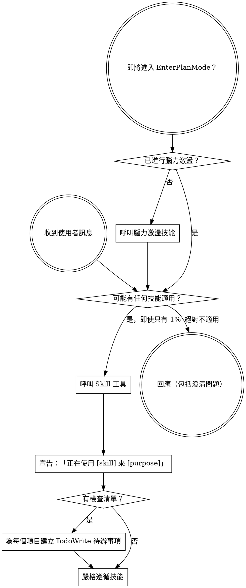

<SUBAGENT-STOP>
如果你是作為子代理被派遣來執行特定任務的，請跳過此技能。
</SUBAGENT-STOP>

<EXTREMELY-IMPORTANT>
如果你認為某個技能甚至有 1% 的機會可能適用於你正在做的事情，你就絕對必須呼叫該技能。

如果某個技能適用於你的任務，你沒有選擇。你必須使用它。

這是不可協商的。這不是可選的。你無法用任何理由繞過這一點。
</EXTREMELY-IMPORTANT>

## 指令優先順序

Superpowers 技能會覆蓋預設系統提示行為，但**使用者指令始終優先**：

1. **使用者的明確指令**（CLAUDE.md、GEMINI.md、AGENTS.md、直接請求）——最高優先級
2. **Superpowers 技能**——在衝突之處覆蓋預設系統行為
3. **預設系統提示**——最低優先級

如果 CLAUDE.md、GEMINI.md 或 AGENTS.md 說「不要使用 TDD」，而技能說「始終使用 TDD」，則遵循使用者的指令。使用者擁有控制權。

## 如何存取技能

**在 Claude Code 中：** 使用 `Skill` 工具。當你呼叫一個技能時，其內容會被載入並呈現給你——直接遵循它。絕不要在技能檔案上使用 Read 工具。

**在 Gemini CLI 中：** 技能透過 `activate_skill` 工具啟用。Gemini 在對話開始時載入技能元資料，並按需啟用完整內容。

**在其他環境中：** 查看你平台的說明文件以了解技能的載入方式。

## 平台適配

技能使用 Claude Code 的工具名稱。非 CC 平台：參見 `references/codex-tools.md`（Codex）以了解工具對應。Gemini CLI 使用者透過 GEMINI.md 自動載入工具對應。

# 使用技能

## 規則

**在任何回應或動作之前，呼叫相關或被要求的技能。** 即使只有 1% 的機會某個技能可能適用，你也應該呼叫該技能來確認。如果一個被呼叫的技能不適用於當前情況，你不需要使用它。

## 紅旗警示

這些想法意味著停下來——你在找藉口：

| 想法 | 現實 |
|---------|---------|
| 「這只是個簡單的問題」 | 問題也是任務。檢查技能。 |
| 「我需要先了解更多背景」 | 技能檢查在澄清問題之前進行。 |
| 「讓我先探索程式碼庫」 | 技能告訴你如何探索。先確認。 |
| 「我可以快速檢查 git/檔案」 | 檔案缺乏對話背景。先檢查技能。 |
| 「讓我先收集資訊」 | 技能告訴你如何收集資訊。 |
| 「這不需要正式的技能」 | 如果技能存在，就使用它。 |
| 「我記得這個技能」 | 技能會演進。閱讀目前版本。 |
| 「這不算是一個任務」 | 動作 = 任務。檢查技能。 |
| 「使用技能太大材小用」 | 簡單的事情會變複雜。使用它。 |
| 「我先做這一件事就好」 | 在做任何事之前先確認。 |
| 「這感覺很有效率」 | 無紀律的行動浪費時間。技能能防止這種情況。 |
| 「我知道那是什麼意思」 | 了解概念 ≠ 使用技能。呼叫它。 |

## 技能優先順序

當多個技能可能適用時，使用以下順序：

1. **流程技能優先**（brainstorming、debugging）——這些決定如何處理任務
2. **實作技能其次**（frontend-design、mcp-builder）——這些指導執行

「讓我們建立 X」→ 先用 brainstorming，再用實作技能。
「修復這個錯誤」→ 先用 debugging，再用特定領域技能。

## 技能類型

**嚴格型**（TDD、debugging）：嚴格遵循。不要偏離紀律。

**彈性型**（模式）：根據情境調整原則。

技能本身會告訴你它屬於哪種類型。

## 使用者指令

指令說明「做什麼」，而非「如何做」。「添加 X」或「修復 Y」並不意味著跳過工作流程。
