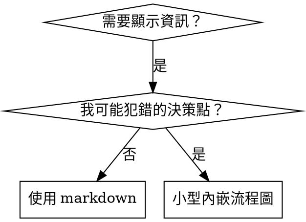

# 撰寫技能

## 概述

**撰寫技能就是將 TDD 應用於流程文件。**

**個人技能存放在代理專屬目錄（Claude Code 為 `~/.claude/skills`，Codex 為 `~/.agents/skills/`）**

您撰寫測試案例（帶有子代理的壓力場景）、觀察它們失敗（基準線行為）、撰寫技能（文件）、觀察測試通過（代理合規），然後重構（填補漏洞）。

**核心原則：** 如果您沒有觀察到代理在沒有技能的情況下失敗，您就不知道技能是否教導了正確的事情。

**必要背景：** 在使用此技能之前，您必須理解 superpowers:test-driven-development。該技能定義了基本的 RED-GREEN-REFACTOR 循環。此技能將 TDD 調整用於文件。

**官方指引：** 有關 Anthropic 官方技能撰寫最佳實踐，請參閱 anthropic-best-practices.md。此文件提供補充本技能 TDD 導向方法的額外模式和指引。

## 什麼是技能？

**技能**是已驗證技術、模式或工具的參考指南。技能幫助未來的 Claude 實例找到並應用有效的方法。

**技能是：** 可重複使用的技術、模式、工具、參考指南

**技能不是：** 關於您曾經如何解決問題的敘述

## 技能的 TDD 對應

| TDD 概念 | 技能建立 |
|-------------|----------------|
| **測試案例** | 帶有子代理的壓力場景 |
| **生產程式碼** | 技能文件（SKILL.md） |
| **測試失敗（紅色）** | 代理在沒有技能的情況下違反規則（基準線） |
| **測試通過（綠色）** | 代理在有技能的情況下合規 |
| **重構** | 在維持合規的同時填補漏洞 |
| **先撰寫測試** | 在撰寫技能之前執行基準線場景 |
| **觀察失敗** | 記錄代理使用的確切合理化說詞 |
| **最小程式碼** | 撰寫解決那些具體違規的技能 |
| **觀察通過** | 驗證代理現在合規 |
| **重構循環** | 找到新的合理化說詞 → 填補 → 重新驗證 |

整個技能建立過程遵循 RED-GREEN-REFACTOR。

## 何時建立技能

**建立時機：**
- 技術對您來說並不直觀
- 您會在不同專案中再次參考
- 模式廣泛適用（非特定專案）
- 他人也會受益

**不要建立的情況：**
- 一次性解決方案
- 其他地方有完整文件的標準實踐
- 特定專案的慣例（放入 CLAUDE.md）
- 機械限制（如果可以用正規表達式/驗證強制執行，就自動化 — 文件留給需要判斷的情況）

## 技能類型

### 技術
具體方法，帶有要遵循的步驟（condition-based-waiting、root-cause-tracing）

### 模式
思考問題的方式（flatten-with-flags、test-invariants）

### 參考
API 文件、語法指南、工具文件（office docs）

## 目錄結構

```
skills/
  skill-name/
    SKILL.md              # 主要參考（必需）
    supporting-file.*     # 僅在需要時
```

**平坦命名空間** — 所有技能在一個可搜尋的命名空間中

**單獨檔案用於：**
1. **大型參考**（100 行以上）— API 文件、全面語法
2. **可重複使用工具** — 腳本、工具程式、範本

**保留內聯：**
- 原則和概念
- 程式碼模式（< 50 行）
- 其他所有內容

## SKILL.md 結構

**前置資料（YAML）：**
- 僅支援兩個欄位：`name` 和 `description`
- 最多 1024 個字元
- `name`：僅使用字母、數字和連字號（無括號、特殊字元）
- `description`：第三人稱，僅描述使用時機（不描述功能）
  - 以「Use when...」開頭，專注於觸發條件
  - 包含具體症狀、情況和背景
  - **絕不總結技能的流程或工作流程**（參見 CSO 章節了解原因）
  - 盡可能保持在 500 個字元以下

```markdown
---
name: Skill-Name-With-Hyphens
description: Use when [specific triggering conditions and symptoms]
---

# Skill Name

## Overview
What is this? Core principle in 1-2 sentences.

## When to Use
[Small inline flowchart IF decision non-obvious]

Bullet list with SYMPTOMS and use cases
When NOT to use

## Core Pattern (for techniques/patterns)
Before/after code comparison

## Quick Reference
Table or bullets for scanning common operations

## Implementation
Inline code for simple patterns
Link to file for heavy reference or reusable tools

## Common Mistakes
What goes wrong + fixes

## Real-World Impact (optional)
Concrete results
```

## Claude 搜尋最佳化（CSO）

**對於發現至關重要：** 未來的 Claude 需要找到您的技能

### 1. 豐富的描述欄位

**目的：** Claude 讀取描述來決定為給定任務載入哪些技能。讓它回答：「我現在應該讀取這個技能嗎？」

**格式：** 以「Use when...」開頭，專注於觸發條件

**關鍵：描述 = 使用時機，而非技能的功能**

描述應僅描述觸發條件。不要在描述中總結技能的流程或工作流程。

**為何重要：** 測試顯示，當描述總結技能的工作流程時，Claude 可能遵循描述而非閱讀完整的技能內容。描述寫著「任務之間進行程式碼審查」導致 Claude 只進行一次審查，即使技能的流程圖清楚顯示兩次審查（規格合規，然後程式碼品質）。

當描述更改為僅「Use when executing implementation plans with independent tasks」（無工作流程總結），Claude 正確閱讀了流程圖並遵循了兩階段審查流程。

**陷阱：** 總結工作流程的描述為 Claude 創造了一個將要採取的捷徑。技能主體成為 Claude 跳過的文件。

```yaml
# ❌ BAD: Summarizes workflow - Claude may follow this instead of reading skill
description: Use when executing plans - dispatches subagent per task with code review between tasks

# ❌ BAD: Too much process detail
description: Use for TDD - write test first, watch it fail, write minimal code, refactor

# ✅ GOOD: Just triggering conditions, no workflow summary
description: Use when executing implementation plans with independent tasks in the current session

# ✅ GOOD: Triggering conditions only
description: Use when implementing any feature or bugfix, before writing implementation code
```

**內容：**
- 使用具體的觸發條件、症狀和情況，表明此技能適用
- 描述*問題*（競態條件、不一致行為），而非*特定語言症狀*（setTimeout、sleep）
- 保持觸發條件不特定於技術，除非技能本身是技術特定的
- 如果技能是技術特定的，在觸發條件中明確說明
- 以第三人稱撰寫（注入系統提示中）
- **絕不總結技能的流程或工作流程**

```yaml
# ❌ BAD: Too abstract, vague, doesn't include when to use
description: For async testing

# ❌ BAD: First person
description: I can help you with async tests when they're flaky

# ❌ BAD: Mentions technology but skill isn't specific to it
description: Use when tests use setTimeout/sleep and are flaky

# ✅ GOOD: Starts with "Use when", describes problem, no workflow
description: Use when tests have race conditions, timing dependencies, or pass/fail inconsistently

# ✅ GOOD: Technology-specific skill with explicit trigger
description: Use when using React Router and handling authentication redirects
```

### 2. 關鍵字覆蓋

使用 Claude 會搜尋的詞彙：
- 錯誤訊息：「Hook timed out」、「ENOTEMPTY」、「race condition」
- 症狀：「flaky」、「hanging」、「zombie」、「pollution」
- 同義詞：「timeout/hang/freeze」、「cleanup/teardown/afterEach」
- 工具：實際命令、函式庫名稱、檔案類型

### 3. 描述性命名

**使用主動語態，動詞優先：**
- ✅ `creating-skills` 而非 `skill-creation`
- ✅ `condition-based-waiting` 而非 `async-test-helpers`

### 4. Token 效率（關鍵）

**問題：** getting-started 和頻繁參考的技能載入到每個對話中。每個 token 都很重要。

**目標字數：**
- getting-started 工作流程：每個 <150 個詞
- 頻繁載入的技能：總共 <200 個詞
- 其他技能：<500 個詞（仍然要簡潔）

**技術：**

**將細節移至工具說明：**
```bash
# ❌ BAD: Document all flags in SKILL.md
search-conversations supports --text, --both, --after DATE, --before DATE, --limit N

# ✅ GOOD: Reference --help
search-conversations supports multiple modes and filters. Run --help for details.
```

**使用交叉參考：**
```markdown
# ❌ BAD: Repeat workflow details
When searching, dispatch subagent with template...
[20 lines of repeated instructions]

# ✅ GOOD: Reference other skill
Always use subagents (50-100x context savings). REQUIRED: Use [other-skill-name] for workflow.
```

**壓縮範例：**
```markdown
# ❌ BAD: Verbose example (42 words)
your human partner: "How did we handle authentication errors in React Router before?"
You: I'll search past conversations for React Router authentication patterns.
[Dispatch subagent with search query: "React Router authentication error handling 401"]

# ✅ GOOD: Minimal example (20 words)
Partner: "How did we handle auth errors in React Router?"
You: Searching...
[Dispatch subagent → synthesis]
```

**消除冗餘：**
- 不要重複交叉參考技能中的內容
- 不要解釋命令中顯而易見的事
- 不要包含相同模式的多個範例

**驗證：**
```bash
wc -w skills/path/SKILL.md
# getting-started workflows: aim for <150 each
# Other frequently-loaded: aim for <200 total
```

**以您所做的或核心洞察命名：**
- ✅ `condition-based-waiting` > `async-test-helpers`
- ✅ `using-skills` 而非 `skill-usage`
- ✅ `flatten-with-flags` > `data-structure-refactoring`
- ✅ `root-cause-tracing` > `debugging-techniques`

**動名詞（-ing）在流程中效果很好：**
- `creating-skills`、`testing-skills`、`debugging-with-logs`
- 主動，描述您正在採取的行動

### 4. 交叉參考其他技能

**撰寫參考其他技能的文件時：**

僅使用技能名稱，帶有明確的要求標記：
- ✅ 好：`**REQUIRED SUB-SKILL:** Use superpowers:test-driven-development`
- ✅ 好：`**REQUIRED BACKGROUND:** You MUST understand superpowers:systematic-debugging`
- ❌ 壞：`See skills/testing/test-driven-development`（不清楚是否必要）
- ❌ 壞：`@skills/testing/test-driven-development/SKILL.md`（強制載入，消耗上下文）

**為何不用 @ 連結：** `@` 語法立即強制載入檔案，在您需要之前就消耗 200k+ 上下文。

## 流程圖使用



**僅在以下情況使用流程圖：**
- 非顯而易見的決策點
- 可能過早停止的流程循環
- 「何時使用 A vs B」的決策

**絕不在以下情況使用流程圖：**
- 參考材料 → 表格、列表
- 程式碼範例 → Markdown 區塊
- 線性指示 → 編號列表
- 沒有語義含義的標籤（step1、helper2）

參閱 @graphviz-conventions.dot 了解 graphviz 樣式規則。

**為您的人類夥伴視覺化：** 使用此目錄中的 `render-graphs.js` 將技能的流程圖渲染為 SVG：
```bash
./render-graphs.js ../some-skill           # Each diagram separately
./render-graphs.js ../some-skill --combine # All diagrams in one SVG
```

## 程式碼範例

**一個優秀的範例勝過許多平庸的範例**

選擇最相關的語言：
- 測試技術 → TypeScript/JavaScript
- 系統除錯 → Shell/Python
- 資料處理 → Python

**好的範例：**
- 完整且可執行
- 有充分注釋解釋原因
- 來自真實場景
- 清晰顯示模式
- 準備好調整（非通用範本）

**不要：**
- 用 5 種以上語言實作
- 建立填空式範本
- 撰寫人為設計的範例

您擅長移植 — 一個優秀的範例就足夠了。

## 檔案組織

### 自包含技能
```
defense-in-depth/
  SKILL.md    # 所有內容內聯
```
使用時機：所有內容都合適，不需要大型參考

### 帶有可重複使用工具的技能
```
condition-based-waiting/
  SKILL.md    # 概述 + 模式
  example.ts  # 可調整的工作助手
```
使用時機：工具是可重複使用的程式碼，而非僅是敘述

### 帶有大型參考的技能
```
pptx/
  SKILL.md       # 概述 + 工作流程
  pptxgenjs.md   # 600 行 API 參考
  ooxml.md       # 500 行 XML 結構
  scripts/       # 可執行工具
```
使用時機：參考材料太大無法內聯

## 鐵律（與 TDD 相同）

```
NO SKILL WITHOUT A FAILING TEST FIRST
```

這適用於新技能和對現有技能的編輯。

在測試前撰寫技能？刪除它。重新開始。
在未測試的情況下編輯技能？同樣的違規。

**沒有例外：**
- 不是「簡單添加」
- 不是「只是添加一個章節」
- 不是「文件更新」
- 不要保留未測試的更改作為「參考」
- 不要在執行測試時「調整」
- 刪除就是刪除

**必要背景：** superpowers:test-driven-development 技能解釋了為何這很重要。相同的原則適用於文件。

## 測試所有技能類型

不同的技能類型需要不同的測試方法：

### 強制紀律的技能（規則/要求）

**範例：** TDD、verification-before-completion、designing-before-coding

**使用以下方式測試：**
- 學術問題：他們理解規則嗎？
- 壓力場景：他們在壓力下合規嗎？
- 多重組合壓力：時間 + 沉沒成本 + 疲憊
- 識別合理化說詞並添加明確反制措施

**成功標準：** 代理在最大壓力下遵循規則

### 技術技能（操作指南）

**範例：** condition-based-waiting、root-cause-tracing、defensive-programming

**使用以下方式測試：**
- 應用場景：他們能正確應用技術嗎？
- 變化場景：他們處理邊緣情況嗎？
- 缺少資訊測試：指示是否有缺口？

**成功標準：** 代理成功將技術應用於新場景

### 模式技能（心智模型）

**範例：** reducing-complexity、information-hiding 概念

**使用以下方式測試：**
- 識別場景：他們能識別模式何時適用嗎？
- 應用場景：他們能使用心智模型嗎？
- 反例：他們知道何時不適用嗎？

**成功標準：** 代理正確識別何時/如何應用模式

### 參考技能（文件/API）

**範例：** API 文件、命令參考、函式庫指南

**使用以下方式測試：**
- 檢索場景：他們能找到正確的資訊嗎？
- 應用場景：他們能正確使用找到的內容嗎？
- 缺口測試：常見使用案例是否涵蓋？

**成功標準：** 代理找到並正確應用參考資訊

## 跳過測試的常見合理化

| 藉口 | 現實 |
|--------|---------|
| 「技能顯然清楚」 | 對您清楚 ≠ 對其他代理清楚。測試它。 |
| 「只是參考」 | 參考可能有缺口、不清楚的章節。測試檢索。 |
| 「測試過度」 | 未測試的技能有問題。總是如此。15 分鐘測試節省數小時。 |
| 「如果出問題我再測試」 | 問題 = 代理無法使用技能。在部署前測試。 |
| 「太繁瑣無法測試」 | 測試比在生產中除錯糟糕的技能更不繁瑣。 |
| 「我有信心它很好」 | 過度自信保證會有問題。無論如何都要測試。 |
| 「學術審查就足夠了」 | 閱讀 ≠ 使用。測試應用場景。 |
| 「沒時間測試」 | 部署未測試的技能之後需要更多時間修復。 |

**所有這些都意味著：部署前測試。沒有例外。**

## 防止合理化攻擊技能

強制紀律的技能（如 TDD）需要抵抗合理化。代理很聰明，在壓力下會找到漏洞。

**心理學注意：** 理解說服技術有效的原因有助於您系統性地應用它們。請參閱 persuasion-principles.md 了解研究基礎（Cialdini，2021；Meincke 等人，2025）關於權威、承諾、稀缺性、社會證明和同一性原則。

### 明確填補每個漏洞

不要只陳述規則 — 禁止具體的解決方法：

<Bad>
```markdown
Write code before test? Delete it.
```
</Bad>

<Good>
```markdown
Write code before test? Delete it. Start over.

**No exceptions:**
- Don't keep it as "reference"
- Don't "adapt" it while writing tests
- Don't look at it
- Delete means delete
```
</Good>

### 處理「精神 vs. 字面」的爭論

在早期添加基礎原則：

```markdown
**Violating the letter of the rules is violating the spirit of the rules.**
```

這切斷了整類「我遵循精神」的合理化說詞。

### 建立合理化表格

從基準線測試中捕捉合理化說詞（參見下方測試章節）。代理提出的每個藉口都放入表格：

```markdown
| Excuse | Reality |
|--------|---------|
| "Too simple to test" | Simple code breaks. Test takes 30 seconds. |
| "I'll test after" | Tests passing immediately prove nothing. |
| "Tests after achieve same goals" | Tests-after = "what does this do?" Tests-first = "what should this do?" |
```

### 建立警示訊號列表

讓代理在合理化時易於自我檢查：

```markdown
## Red Flags - STOP and Start Over

- Code before test
- "I already manually tested it"
- "Tests after achieve the same purpose"
- "It's about spirit not ritual"
- "This is different because..."

**All of these mean: Delete code. Start over with TDD.**
```

### 為違規症狀更新 CSO

在描述中添加：即將違反規則的症狀：

```yaml
description: use when implementing any feature or bugfix, before writing implementation code
```

## 技能的 RED-GREEN-REFACTOR

遵循 TDD 循環：

### 紅色：撰寫失敗測試（基準線）

在沒有技能的情況下帶著子代理執行壓力場景。記錄確切行為：
- 他們做了什麼選擇？
- 他們使用了哪些合理化說詞（逐字）？
- 哪些壓力觸發了違規？

這是「觀察測試失敗」— 您必須在撰寫技能之前看到代理自然的行為。

### 綠色：撰寫最小技能

撰寫解決那些具體合理化說詞的技能。不要為假設性案例添加額外內容。

帶著技能執行相同場景。代理現在應該合規。

### 重構：填補漏洞

代理找到新的合理化說詞？添加明確反制措施。重新測試直到無懈可擊。

**測試方法論：** 參閱 @testing-skills-with-subagents.md 了解完整的測試方法論：
- 如何撰寫壓力場景
- 壓力類型（時間、沉沒成本、權威、疲憊）
- 系統性填補漏洞
- 元測試技術

## 反模式

### ❌ 敘述性範例
「在 2025-10-03 的會話中，我們發現空的 projectDir 導致...」
**為何糟糕：** 太具體，不可重複使用

### ❌ 多語言稀釋
example-js.js、example-py.py、example-go.go
**為何糟糕：** 品質平庸，維護負擔

### ❌ 流程圖中的程式碼
```dot
step1 [label="import fs"];
step2 [label="read file"];
```
**為何糟糕：** 無法複製貼上，難以閱讀

### ❌ 通用標籤
helper1、helper2、step3、pattern4
**為何糟糕：** 標籤應有語義含義

## 停止：在移至下一個技能前

**撰寫任何技能後，您必須停止並完成部署流程。**

**不要：**
- 在未測試每個技能的情況下批次建立多個技能
- 在當前技能驗證之前移至下一個技能
- 以「批次更有效率」為由跳過測試

**以下部署核對清單對每個技能都是強制性的。**

部署未測試的技能 = 部署未測試的程式碼。這是違反品質標準的行為。

## 技能建立核對清單（TDD 調整版）

**重要：使用 TodoWrite 為以下每個核對清單項目建立待辦事項。**

**紅色階段 — 撰寫失敗測試：**
- [ ] 建立壓力場景（強制紀律技能需 3 個以上組合壓力）
- [ ] 在沒有技能的情況下執行場景 — 逐字記錄基準線行為
- [ ] 識別合理化說詞/失敗的模式

**綠色階段 — 撰寫最小技能：**
- [ ] 名稱僅使用字母、數字、連字號（無括號/特殊字元）
- [ ] YAML 前置資料僅包含 name 和 description（最多 1024 個字元）
- [ ] 描述以「Use when...」開頭並包含具體觸發條件/症狀
- [ ] 描述以第三人稱撰寫
- [ ] 整個文件中的關鍵字用於搜尋（錯誤、症狀、工具）
- [ ] 帶有核心原則的清晰概述
- [ ] 解決紅色階段識別的具體基準線失敗
- [ ] 程式碼內聯或連結至單獨檔案
- [ ] 一個優秀的範例（非多語言）
- [ ] 帶著技能執行場景 — 驗證代理現在合規

**重構階段 — 填補漏洞：**
- [ ] 從測試中識別新的合理化說詞
- [ ] 添加明確反制措施（如果是強制紀律技能）
- [ ] 從所有測試迭代中建立合理化表格
- [ ] 建立警示訊號列表
- [ ] 重新測試直到無懈可擊

**品質檢查：**
- [ ] 僅在決策非顯而易見時使用小型流程圖
- [ ] 快速參考表格
- [ ] 常見錯誤章節
- [ ] 無敘述性故事
- [ ] 僅用於工具或大型參考的支援檔案

**部署：**
- [ ] 將技能提交到 git 並推送到您的 fork（如果已配置）
- [ ] 如果廣泛有用，考慮透過 PR 貢獻回去

## 發現工作流程

未來的 Claude 如何找到您的技能：

1. **遇到問題**（「測試不穩定」）
3. **找到技能**（描述匹配）
4. **掃描概述**（這相關嗎？）
5. **閱讀模式**（快速參考表格）
6. **載入範例**（僅在實作時）

**為此流程最佳化** — 盡早並頻繁放置可搜尋的術語。

## 結論

**建立技能就是流程文件的 TDD。**

相同的鐵律：沒有失敗測試就沒有技能。
相同的循環：紅色（基準線）→ 綠色（撰寫技能）→ 重構（填補漏洞）。
相同的好處：更好的品質、更少的意外、無懈可擊的結果。

如果您為程式碼遵循 TDD，就為技能遵循它。這是同樣的紀律應用於文件。
